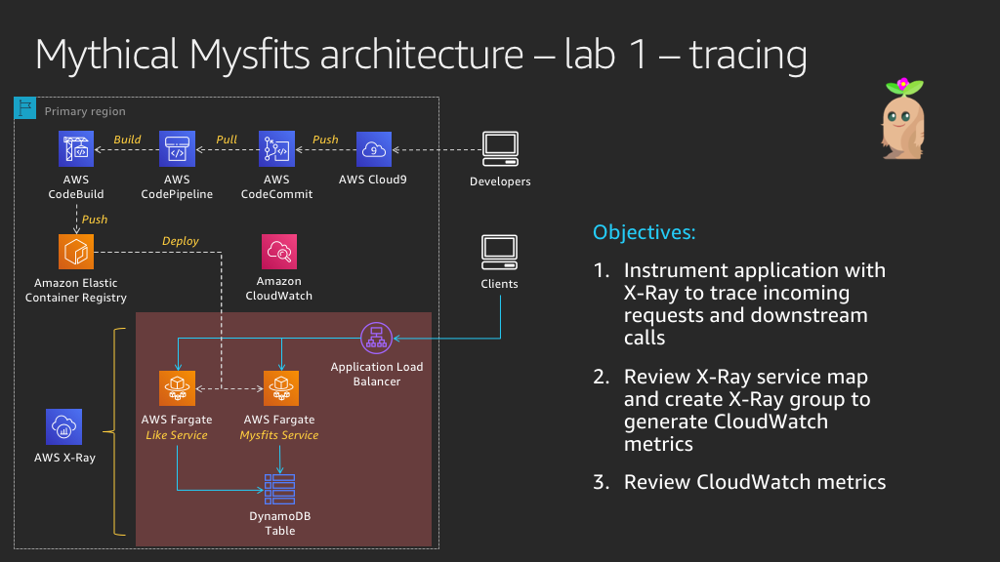
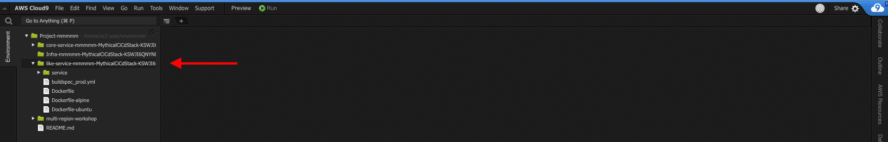
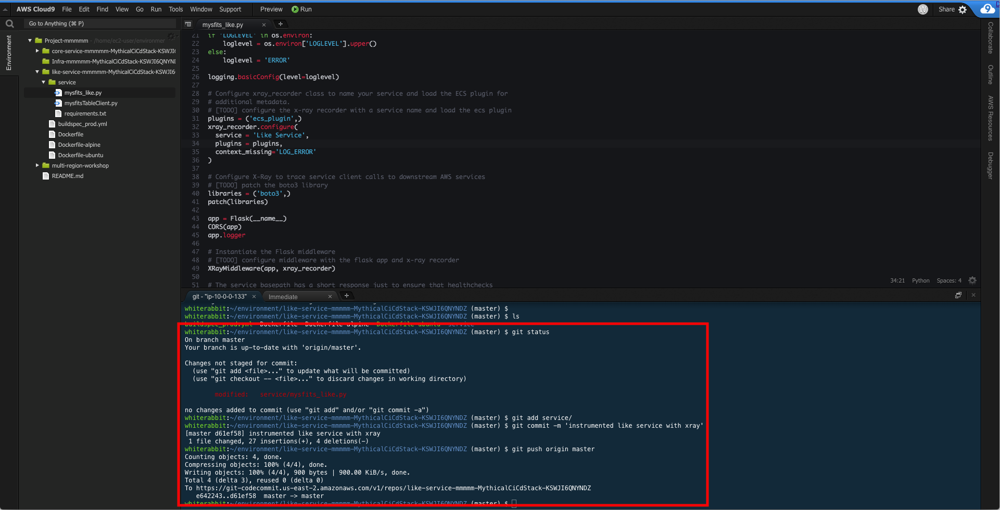
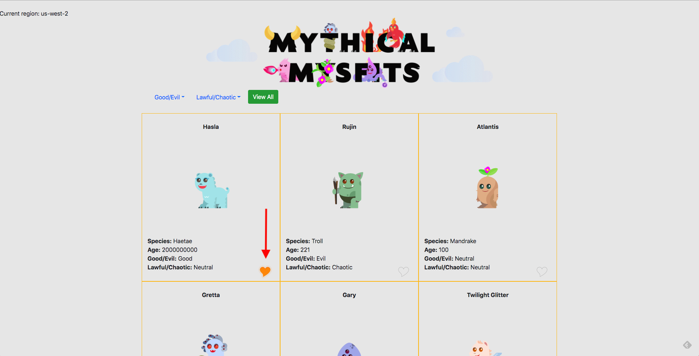
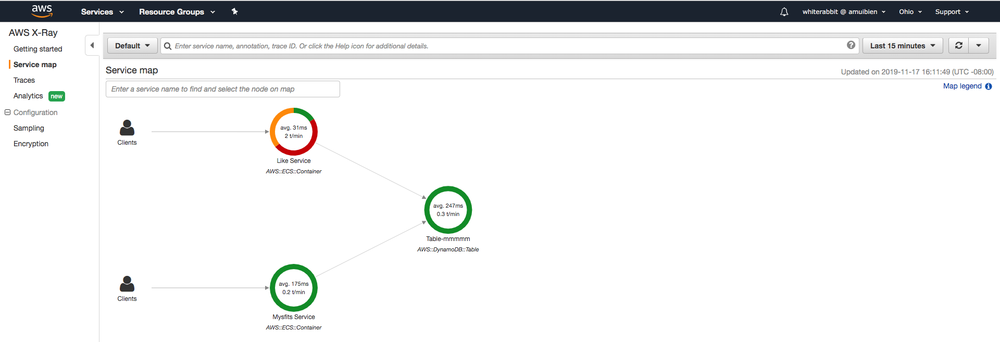
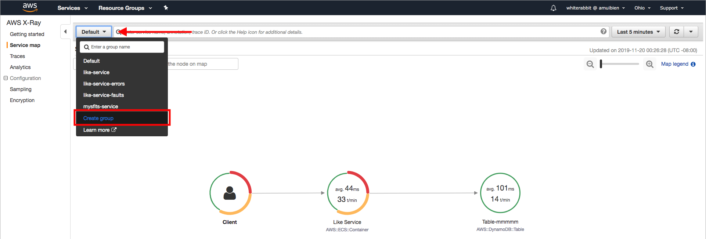
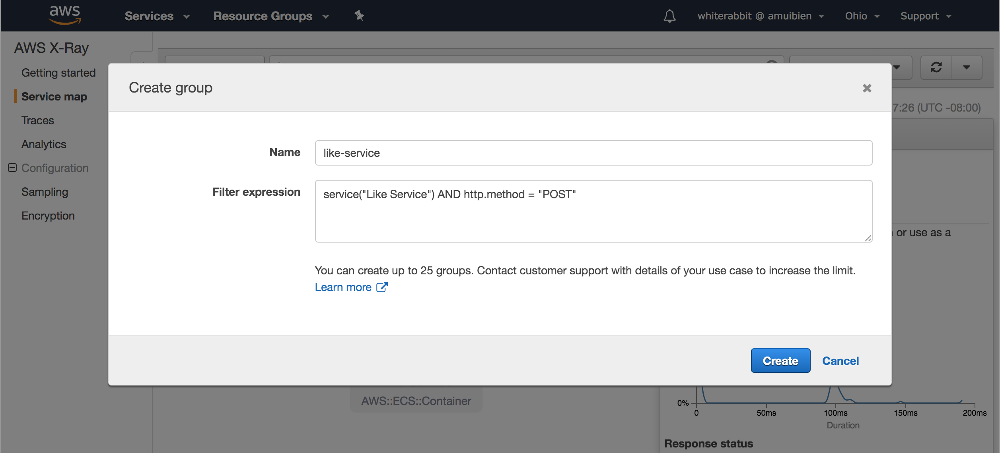

# Mythical Mysfits: Building Multi-Region Applications that Align with BC/DR Objectives

## Workshop progress
✅ [Lab 0: Workshop Initialization](../lab-0-init)

**Lab 1: Instrument Observability - Distributed Tracing with AWS X-Ray**

- [Instrument the like service code using AWS X-Ray SDK and AWS Cloud9](#2-instrument-the-like-service-code-using-the-aws-x-ray-sdk-and-cloud9)
- [Deploy like service changes](#3-deploy-the-changes-you-made-to-the-like-service)

[Lab 2: Operationalize Observability - Aggregate Metrics](../lab-2-agg)

[Lab 3: Preparing for Multi-Region Deployments](../lab-3-mr-prep)

[Lab 4: Implement Traffic Management - Global Accelerator](../lab-4-globalacc)

[Lab 5: Load Test and Failover your multi-region application](../lab-5-loadtest)

## LAB 1 - Instrument Observability - Distributed Tracing with AWS X-Ray

Observability helps quantify how we are able to meet our availability requirements. An important aspect of observability especially in a microservices architecture is distributed tracing. This enables the ability to profile a request as it passes through our application architecture which may involve one or more services and potentially interactions with backend data stores. Data captured from traces helps teams understand how the application behaves under various conditions and can be incredibly helpful when issues arise. For example, developers can use the data to identify inefficiencies in code and prioritize their sprints. Operations or SRE (site reliability engineering) teams can use the data to diagnose or triage unusual latencies or failures. Infrastructure engineers can use the data to make adjustments to resident scaling policies or resources supporting particular services.

AWS X-Ray is a distributed tracing service that provides a SDK to instrument your applications, a daemon to aggregate and deliver trace data to the X-Ray service, and a dashboard to view a service map which is a visualization of the trace data. If you would like to read more in depth about X-Ray, check out these links to documentation - [What is X-Ray?](https://docs.aws.amazon.com/xray/latest/devguide/aws-xray.html) and [X-Ray Concepts](https://docs.aws.amazon.com/xray/latest/devguide/xray-concepts.html)

In this lab, you'll continue where our lead developer left off before she was pulled to work on personalization for the application. No surprises there since the PM just got back from re:Invent, and there were many AI/ML sessions in his schedule.



The Mythical Mysfits application is made up of (2) microservices:

1. The Mysfits service (also referred to as the Core service) serves the Angular front-end application and hosts an API that returns Mysfit profiles from DynamoDB.
2. The Like service tracks the number of likes for a particular mysfit. When a visitor clicks on the heart icon next to a mysfit in the app, a counter for that mysfit's profile is incremented in DynamoDB.

Our lead developer successfully instrumented the Mysfits service, capturing data for inbound http requests and downstream calls to DynamoDB. We need your help to do the same for the Like service, so we have a more complete picture. Don't worry if you're not a developer, we'll guide you with the lab instructions and provide hints along the way. If you really get stuck, skip to the final hint where we provide the fully instrumented app code. Good luck!

### Instructions

### [1] Quick note about the X-Ray daemon

When you instrument an application with the X-Ray SDK to enable tracing, trace data is sent to the X-Ray service via an X-Ray daemon process. To save time in the workshop and focus on the more interesting bits, the CloudFormation template you ran already included the X-Ray daemon as a sidecar container in the Mysfits and Like service ECS task definitions. Just know that this is how trace data is being relayed to the X-Ray service. Also, this process can run as a local process for non-containerized applications or as a standalone service, expand the Learn more section below for documentation links to read more on the topic if you're interested.

<details>
<summary>Learn more: What is the X-Ray daemon? And what is a sidecar container</summary>
The AWS X-Ray daemon is an open source software application that listens for traffic on UDP port 2000. It gathers raw segment data and relays it to the AWS X-Ray API. When deployed as a sidecar container with Fargate, the Task IAM role is what authorizes it to communicate with the X-Ray API. The workshop CloudFormation template you ran earlier already created a role that has the necessary permissions. Also, AWS X-Ray provides a managed Docker container image of the X-Ray daemon that you can run as a sidecar. If you'd like to customize the software or container image, you can find the source code on GitHub and a sample Dockerfile in our documentation to build from.

Further reading:

* [X-Ray daemon documentation](https://docs.aws.amazon.com/xray/latest/devguide/xray-daemon.html)
* [X-Ray daemon GitHub repo](https://github.com/aws/aws-xray-daemon)
* [X-Ray daemon permissions](https://docs.aws.amazon.com/xray/latest/devguide/xray-daemon.html#xray-daemon-permissions)
* [X-Ray sample dockerfile](https://docs.aws.amazon.com/xray/latest/devguide/xray-daemon-ecs.html#xray-daemon-ecs-build)
* [Application Tracing on Fargate with AWS X-Ray](https://github.com/aws-samples/aws-xray-fargate)

Similar to how an actual sidecar is attached to a motorocycle, a sidecar container sits alongside the main container in your unit of deployment and adds functionality to the main container. In Kubernetes, a unit of deployment is a pod, or in ECS terms, a unit of deployment is a task. Both pods and tasks can include multiple containers which is how sidecar patterns are deployed. A common example of a sidecar pattern in practice is a logger. Let's say you have an nginx container deployed and want to capture access and error logs. The logger could be deployed as a sidecar container used to capture and forward access/error logs from the nginx container to your logging destination of choice. In the example of X-Ray, the sidecar runs the daemon process that listens for events and proxies it to the X-Ray service.

</details>

### [2] Instrument the Like service code using the AWS X-Ray SDK and Cloud9

<details>
<summary>Learn more: The AWS X-Ray SDK</summary>

AWS provides X-Ray SDKs for many popular programming languages such as python, javascript, go, java, etc. The SDK provides interceptors to trace incoming HTTP requests, client handlers to instrument AWS SDK clients used to call other AWS services, and an HTTP client to instrument calls to other http web services. You can also patch certain supported libraries such as database clients. Support will vary with each language specific SDK, so consult the documentation to read more. Since Mythical Mysfits services are based on Flask, you'll use the python SDK. Additionally, the X-Ray SDK for Python includes middleware that traces incoming requests for Flask (and Django) frameworks. Convenient! If you aren't using either of these, but still use python for your implementation, you can use the python SDK to manually instrument segments.

When instrumenting an app with the X-Ray SDK, you first need to install the SDK. For convenience, that was already done for you during workshop bootstrap. If you look at `requirements.txt` for the Like service, you'll see we include the `aws-xray-sdk` when the container image is built.

Further reading:

* [What is X-Ray?](https://docs.aws.amazon.com/xray/latest/devguide/aws-xray.html)
* [AWS X-Ray SDK for Python](https://docs.aws.amazon.com/xray/latest/devguide/xray-sdk-python.html)

</details>

**PLEASE READ: You have (2) options at this point:**

1. Follow the steps below, using the provided documentation (and hints if you get stuck), to add lines of instrumentation code to the Like service. If you go this route, try not spend more than 5 min on each step if you're at an AWS event with a time limit. We want you to be able to get through as many of the labs as possible.

    OR

2. Copy the instrumented code from the lab-1-xray/answers folder and move on to Section 3 where you push the instrumented code to the CI/CD pipeline for build and deployment. If you're short on time or would rather focus on the traffic management bits later in the workshop, reveal and follow the `Option 2 step by step` below.

**Choose your adventure!**

<details>
<summary>Option 2 step by step</summary>

1. In the Cloud9 IDE terminal window, navigate to the Like service working directory cloned from Code Commit.

    ```
    $ cd ~/environment/like-service-[PRESS TAB TO AUTO COMPLETE AND PRESS ENTER]
    ```

2. Copy the instrumented Like service code from the answers directory into this working directory.

    ```
    $ cp ~/environment/aws-multi-region-bc-dr-workshop/lab-1-xray/answers/mysfits_like.py ./service
    ```

    [*Click here to skip to Section 3 to deploy your changes*](#3-deploy-the-changes-you-made-to-the-like-service)

<br>
</details>

If you're choosing Option 1, read on...

In this section, you will use the Cloud9 IDE, which should still be open from the last lab, to make edits to the Like service code. In each of the following activities, **you will be editing one file, `mysfits_like.py`**. The bootstrap script you ran in the last lab cloned the Like service code to your Cloud9 IDE

#### a. Import necessary functions and classes from the X-Ray SDK to trace incoming HTTP requests for Flask applications and downstream calls to DynamoDB

1. Expand the Like service folder in the directory tree to the left; the name will start with `like-service-` followed by the CloudFormation stack name and more text.

    

2. Expand the `service` folder and double-click on `mysfits_like.py` to load it in the editor pane. Your teammate commented the code to help guide you. You'll also notice `TODO` statements following those comments, that's where you'll add lines of code to accomplish the todo.

3. Add (3) lines of code to:

    * Load the X-Ray recorder class from the SDK's core module
    * Load the X-Ray patch function from the SDK's core module
    * Load the middleware function for flask apps

    Note: There are a couple approaches to patching client libraries using either the `patch_all` or `patch` modules. We choose the latter for specificity, but feel free to explore `patch_all` on your own time.

    Here is some documentation to help you, and if you get confused, see the hint in the next step:

    * [X-Ray Python Middleware](https://docs.aws.amazon.com/xray/latest/devguide/xray-sdk-python-middleware.html)
    * [Patching libraries](https://docs.aws.amazon.com/xray/latest/devguide/xray-sdk-python-patching.html)
    * [General AWS X-Ray SDK for Python API reference](https://docs.aws.amazon.com/xray-sdk-for-python/latest/reference/index.html)

4. Once you feel like you've added the appropriate lines, compare your work with the hint below.

    <details>
    <summary>HINT: Completed imports</summary>

    ```
    # Load functions/classes from aws xray sdk to instrument this service to trace incoming
    # http requests and downstream aws sdk calls. This includes the X-Ray Flask middleware
    # [TODO] load x-ray recorder class
    # [TODO] load x-ray patch function
    # [TODO] load middleware function for flask
    from aws_xray_sdk.core import xray_recorder
    from aws_xray_sdk.core import patch
    from aws_xray_sdk.ext.flask.middleware import XRayMiddleware
    ```

</details>

#### b. Configure the X-Ray recorder

<details>
<summary>Learn more: X-Ray recorder configuration</summary>

The X-Ray recorder can be customized by setting class attributes. For example, you can name your service segments, enrich traces data with additional metadata by including service plugins, set the address/port of your daemon process (if not using the default of 127.0.0.1/udp), and more.

Further reading:

* [Configuring the X-Ray SDK for Python](https://docs.aws.amazon.com/xray/latest/devguide/xray-sdk-python-configuration.html)
* [AWS X-Ray SDK API Reference - Configure Global Recorder](https://docs.aws.amazon.com/xray-sdk-for-python/latest/reference/configurations.html)

</details>

1. Configure (3) attributes in the xray_recorder class to:

    * Set the name of the service to be 'Like Service'
    * Enable the ECS service plugin for additional metadata to be added to the trace
    * Configure the recorder behavior when instrumented code attempts to record data when no segment is open. The behavior we want is to log an error but continue.

    Here is some documentation to help you, and if you get confused, see the hint in the next step:

    * [Service Plugins](https://docs.aws.amazon.com/xray/latest/devguide/xray-sdk-python-configuration.html#xray-sdk-python-configuration-plugins)
    * [Recorder Configuration in Code](https://docs.aws.amazon.com/xray/latest/devguide/xray-sdk-python-configuration.html#xray-sdk-python-middleware-configuration-code)
    * [AWS X-Ray SDK API Reference - Configure Global Recorder](https://docs.aws.amazon.com/xray-sdk-for-python/latest/reference/configurations.html)

2. Once you feel like you've added the appropriate lines, compare your work with the hint below.

    <details>
    <summary>HINT: Completed xray_recorder configuration</summary>

    ```
    # Configure xray_recorder class to name your service and load the ECS plugin for
    # additional metadata.
    # [TODO] configure the x-ray recorder with a service name and load the ecs plugin
    plugins = ('ecs_plugin',)
    xray_recorder.configure(
    service = 'Like Service',
    plugins = plugins,
    context_missing='LOG_ERROR'
    )
    ```

    Note: In case you're wondering why there's a trailing comma after `'ecs_plugin'`, it's because plugins is a tuple, and in Python a single value tuple or singleton requires a comma.

    </details>

#### c. Patch AWS SDK clients to enable tracing of downstream calls to DynamoDB

1. Earlier, you imported the `patch` function from the X-Ray SDK core. Use that to patch boto3 which is used by the mysfitsTableClient.

    Here is some documentation to help you, and if you get confused, see the hint in the next step:

    * [Patching Libraries](https://docs.aws.amazon.com/xray/latest/devguide/xray-sdk-python-patching.html)

2. Once you feel like you've added the appropriate lines, compare your work with the hint below.

    <details>
    <summary>HINT: Completed boto3 patching</summary>

    ```
    # Configure X-Ray to trace service client calls to downstream AWS services
    # [TODO] patch the boto3 library
    libraries = ('boto3',)
    patch(libraries)
    ```

    Note: In case you're wondering why there's a trailing comma after `'boto3'`, it's because libraries is a tuple, and in Python a single value tuple or singleton requires a comma.

    </details>

#### d. And finally, configure the Flask middleware

1. Instantiate the Flask middleware to enable tracing.

    Here is some documentation to help you, and if you get confused, see the hint in the next step:

    * [Adding Flask Middleware](https://docs.aws.amazon.com/xray/latest/devguide/xray-sdk-python-middleware.html#xray-sdk-python-adding-middleware-flask)

2. Once you feel like you've added the appropriate lines, compare your work with the hint below.

    <details>
    <summary>HINT: Completed enabling Flask middleware</summary>

    ```
    # Instantiate the Flask middleware
    # [TODO] configure middleware with the flask app and x-ray recorder
    XRayMiddleware(app, xray_recorder)
    ```

    </details>

#### e. Checkpoint

You made it! The Like service should be instrumented. Reveal the final hint to compare your work.

<details>
<summary>FINAL HINT: SPOILERS AHEAD - Fully instrumented Like service code</summary>

```
#!/usr/bin/python
from __future__ import print_function
import os
import sys
import logging
import random
from urlparse import urlparse
from flask import Flask, jsonify, json, Response, request, abort
from flask_cors import CORS
import mysfitsTableClient

# Load functions/classes from aws xray sdk to instrument this service to trace incoming
# http requests and downstream aws sdk calls. This includes the X-Ray Flask middleware
# [TODO] load x-ray recorder class
# [TODO] load x-ray patch function
# [TODO] load middleware function for flask
from aws_xray_sdk.core import xray_recorder
from aws_xray_sdk.core import patch
from aws_xray_sdk.ext.flask.middleware import XRayMiddleware

if 'LOGLEVEL' in os.environ:
    loglevel = os.environ['LOGLEVEL'].upper()
else:
    loglevel = 'ERROR'

logging.basicConfig(level=loglevel)

# Configure xray_recorder class to name your service and load the ECS plugin for
# additional metadata.
# [TODO] configure the x-ray recorder with a service name and load the ecs plugin
plugins = ('ecs_plugin',)
xray_recorder.configure(
  service = 'Like Service',
  plugins = plugins,
  context_missing='LOG_ERROR'
)

# Configure X-Ray to trace service client calls to downstream AWS services
# [TODO] patch the boto3 library
libraries = ('boto3',)
patch(libraries)

app = Flask(__name__)
CORS(app)
app.logger

# Instantiate the Flask middleware
# [TODO] configure middleware with the flask app and x-ray recorder
XRayMiddleware(app, xray_recorder)

# The service basepath has a short response just to ensure that healthchecks
# sent to the service root will receive a healthy response.
@app.route("/")
def health_check_response():
    return jsonify({"message" : "This is for health checking purposes."})

@app.route("/mysfits/<mysfit_id>/like", methods=['POST'])
def like_mysfit(mysfit_id):
    app.logger.info('Like received.')
    if os.environ['CHAOSMODE'] == "on":
        n = random.randint(1,100)
        if n < 30:
            app.logger.warn('WARN: simulated 500 activated')
            abort(500)
        elif n < 60:
            app.logger.warn('WARN: simulated 404 activated')
            abort(404)
        app.logger.warn('WARN: This thing should NOT be left on..')

    service_response = mysfitsTableClient.likeMysfit(mysfit_id)
    flask_response = Response(service_response)
    flask_response.headers["Content-Type"] = "application/json"
    return flask_response

# Run the service on the local server it has been deployed to
if __name__ == "__main__":
    app.run(host="0.0.0.0", port=8080)
```

</details>

Now you are ready to check in your code and let the CI/CD pipeline build revised container images and re-deploy the Like service with Fargate.

### [3] Deploy the changes you made to the Like service

Since Mythical Mysfits moved to a microservices architecture, it was apparent that an automated CI/CD pipeline was necessary in order to remain agile. The dev team adopted [AWS CodePipeline](https://docs.aws.amazon.com/codepipeline/latest/userguide/welcome.html) which coordinates a few tasks:

1. Watches for changes in the source repository which is [AWS CodeCommit](https://docs.aws.amazon.com/codecommit/latest/userguide/welcome.html)
2. Leverages [AWS CodeBuild](https://docs.aws.amazon.com/codebuild/latest/userguide/welcome.html) to build new container images for the revised source code and pushes the created image to ECR.
3. Deploys the new image in ECR by updating the ECS Fargate service.

#### a. Check in Like service code to kick off the pipeline

1. In your Cloud9 terminal, navigate to the Like service folder.

    ```
    $ cd ~/environment/like-service-[PRESS TAB TO AUTO COMPLETE AND PRESS ENTER]
    ```

2. Commit your updated code and push to master. If you're not familiar with git commands, expand the hint below for step by step.

    <details>
    <summary>HINT: Git commands step by step</summary>

    Check that the like service code was modified.
    ```
    $ git status
    ```
    Add file to staging.
    ```
    $ git add service/
    ```
    Commit the file to your local repository.
    ```
    $ git commit -m "instrumented like service with xray"
    ```
    Push the commit to CodeCommit (remote repository)
    ```
    $ git push origin master
    ```

    The commands and output should look similar to this:
    

    </details>

    The pipeline will take a few minutes to complete, so feel free to move on to the next section. If you want to watch the pipeline, navigate to the CodePipeline dashboard in the AWS console and click on the pipeline for the Like service which begins with `LikePipeline-`. When it's completed, it will look similar to the screenshot below.

    

### [4] Test your configuration

Now that you've instrumented the like service, you should see additional trace data being reported to the service map in the X-Ray console whenever users use the like functionality in the application. This will include inbound http requests to the X-Ray service as well as downstream calls to DynamoDB when it increments the like counters for each mysfit liked.

#### a. Confirm you have a complete service map for the Mythical Mysfits application

1. If you already have the ALB's DNS name handy, move to step 2. Otherwise, retrieve the ALB's DNS name from the CloudFormation stack outputs. The output values are written to a JSON file local to your Cloud9 environment as a part of the bootstrap script. Run the following command in your Cloud9 terminal to get the load balancer's DNS name:

    ```
    $ cat ~/environment/aws-multi-region-bc-dr-workshop/cfn-output.json | grep LoadBalancerDNS
    ```
    Note: You can also visit the CloudFormation dashboard, click on the workshop stack and find LoadBalancerDNS in the outputs tab.

2. Open a new tab and enter the load balancer DNS name to load the Mythical Mysfits application.  When the page loads, you should see a grid of mysfits and notice a heart icon in the bottom right corner of each box. Click on a few hearts for a few mysfits to generate some traffic to the Like service. The service was launched with chaos mode 'on' which randomly returns 404s and 500s, so you'd see more interesting data in the X-Ray service map. Keep clicking on the hearts until it lights up orange for a few mysfits.

    

3. Once you've liked a few mysfits, open a new browser tab and navigate to the [AWS X-Ray dashboard service map view](http://console.aws.amazon.com/xray/home#/service-map?timeRange=PT30M). You should see a service map representative of the Mythical Mysfits application, something like this -

    

4. Take some time to explore the service map a bit more. Note the information you can glean by clicking on each service. Also, explore the raw trace data by clicking on **Trace** in the left menu.

### [5] Reduce the signal from the noise

One thing you'll notice is an abundance of GET requests to the Like service which doesn't add up since the like funtionality is based on POST requests. These GETs are health checks from the ALB, which skews the statistics. Filter expressions to the rescue, and they do exactly as the name implies. It's an expression that filters based on given criteria, e.g. service name, errors, src/dst relationships, annotations. Feel free to experiment with filter expressions by entering them into the search bar in the X-Ray dashboard; for your reference - [filter expression documentation](https://docs.aws.amazon.com/xray/latest/devguide/xray-console-filters.html)

Filter expressions can also be used to group traces. This is important because by creating a group, X-Ray will output the approximate trace counts for a given filter expression as a CloudWatch metric. Subsequently, you can create CloudWatch alarms or use these numbers in an operational dashboard, as appropriate. For example, you could create a trace group that filters out throttling (i.e. 429 error codes) to understand whether a service is overwhelmed.

Note: Throughout this workshop, we're going to focus purely on the Like service to focus time and effort. In reality, you'd want to implement filter expressions for all services in your application architecture, especially if you are going to use trace data to help determine application health and availability for failover purposes, for example.

#### a. Filter POST requests to the Like Service

1. Create a trace group using a filter expression that extracts POST requests to the Like service. The generated CloudWatch metric will be an additional data point to help indicate service health.

    Note: There is a basic utility in the lab-1-xray/utils folder that will generate a constant flow of artificial traffic to the like service as you work on implementing the filters. This may be more convenient than manually clicking through the website to generate requests. Choice is up to you. To use the utility, run this command -

    ```
    $ python ~/environment/aws-multi-region-bc-dr-workshop/lab-1-xray/utils/ryder.py
    ```

    You will be prompted for an endpoint to target. Enter the load balancer DNS name. The command and output should look something like this -

    ```
    whiterabbit:~/environment/like-service-mmm-MythicalCiCdStack-WZO1F61QZRZX/service (master) $ python ~/environment/aws-multi-region-bc-dr-workshop/lab-1-xray/utils/ryder.py
    Enter an ENDPOINT:PORT combination [port is optional]: alb-mmm-1270147538.us-west-2.elb.amazonaws.com
    Request 0 returned: <Response [500]>
    Request 1 returned: <Response [404]>
    Request 2 returned: <Response [404]>
    Request 3 returned: <Response [200]>
    Request 4 returned: <Response [404]>
    Request 5 returned: <Response [404]>
    ```


    `Ctrl-C` will kill the process.

    Here is some documentation to help you along. If you get stuck/confused or are short on time, reveal the hint below for step by step:

    * [Filter expression documentation](https://docs.aws.amazon.com/xray/latest/devguide/xray-console-filters.html)

<details>
<summary>HINT: Detailed step by step</summary>

1. Click on **Create group** in the dropdown menu next to the X-Ray dashboard's filtering search bar.

    

2. Enter a name, e.g. `like-service`

3. Enter `service("Like Service") AND http.method = "POST"` into the filter expression field.

    **PLEASE READ:** if you copy/paste the expression above into the filter expression field, make sure you type a space at the end. We discovered a bug in the UI where field validation seems to expect some keyboard input; Ctrl-V alone will not work, hence adding the space. The product team has been made aware, and this will be fixed in a future release. Apologies for the inconvenience.

4. Click **Create**

    

</details>

#### b. Filter on HTTP error codes

1. Create a trace group using filter expressions to catch 404s and 500s; the X-Ray service refers to these as errors and faults, respectively. The generated CloudWatch metric will be an additional data point to help indicate service health and potentially be used as an alarm for notifications or even automated failover.

    Here is some documentation to help you along. If you get stuck/confused or are short on time, reveal the hint below for step by step::

    * [Filter expression documentation](https://docs.aws.amazon.com/xray/latest/devguide/xray-console-filters.html)

<details>
<summary>HINT: Detailed step by step</summary>

1. Click on **Create group** in the dropdown menu next to the X-Ray dashboard's filtering search bar.

    

2. Enter a name, e.g. `like-service-errors-faults`

3. Enter `service("Like Service") { error = true OR fault = true }` into the filter expression field.

    **PLEASE READ:** if you copy/paste the expression above into the filter expression field, make sure you type a space at the end. We discovered a bug in the UI where field validation seems to expect some keyboard input; Ctrl-V alone will not work, hence adding the space. The product team has been made aware, and this will be fixed in a future release. Apologies for the inconvenience.

4. Click **Create**

</details>

### Checkpoint
Congratulations!!!  You've successfully instrumented the Like service to enable tracing. You also used filter expressions to group important trace data. This data gets reported to CloudWatch as a metric which you can use for operational dashboards and setting up alarms. On to the next lab!

Proceed to [Lab 2](../lab-2-agg)!

[*^ back to top*](#lab-1-distributed-tracing-with-AWS-X-Ray)

## Participation

We encourage participation; if you find anything, please submit an [issue](https://github.com/aws-samples/aws-multi-region-bc-dr-workshop/issues). However, if you want to help raise the bar, submit a [PR](https://github.com/aws-samples/aws-multi-region-bc-dr-workshop/pulls)!

## License

This library is licensed under the Apache 2.0 License.
