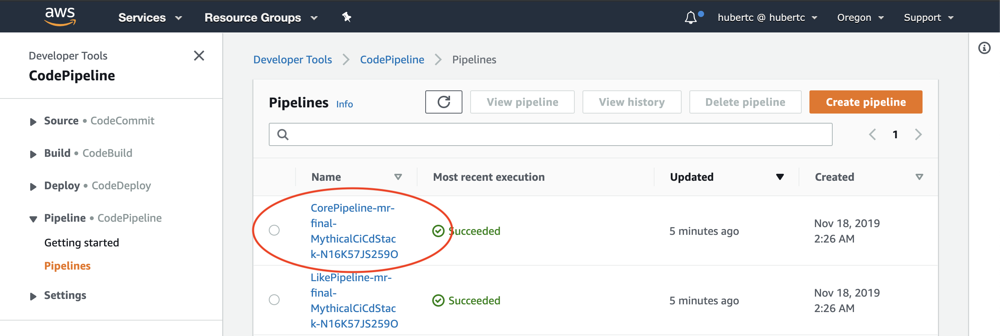
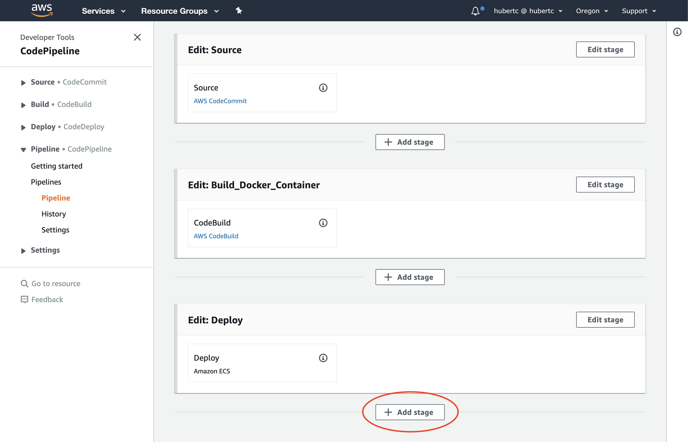
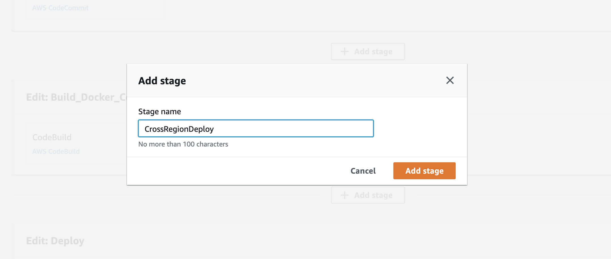
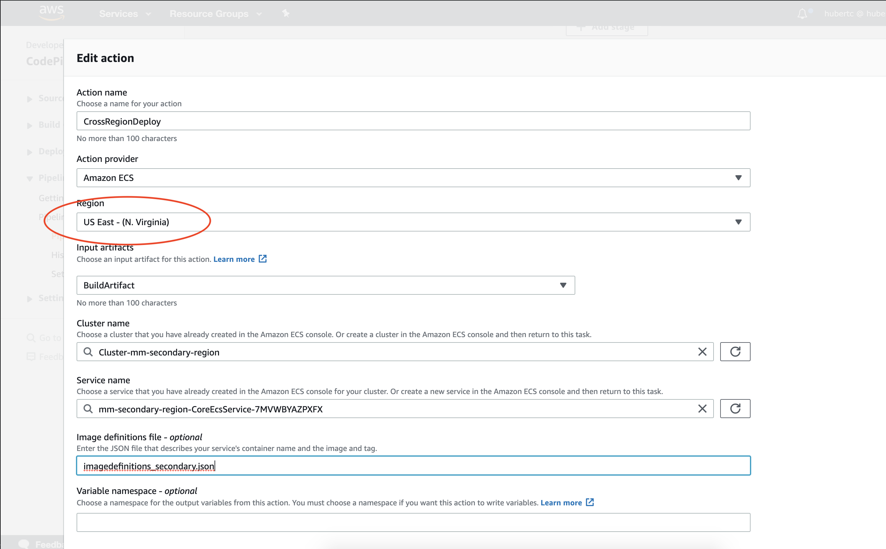
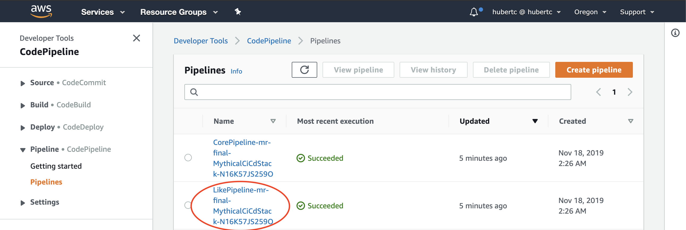
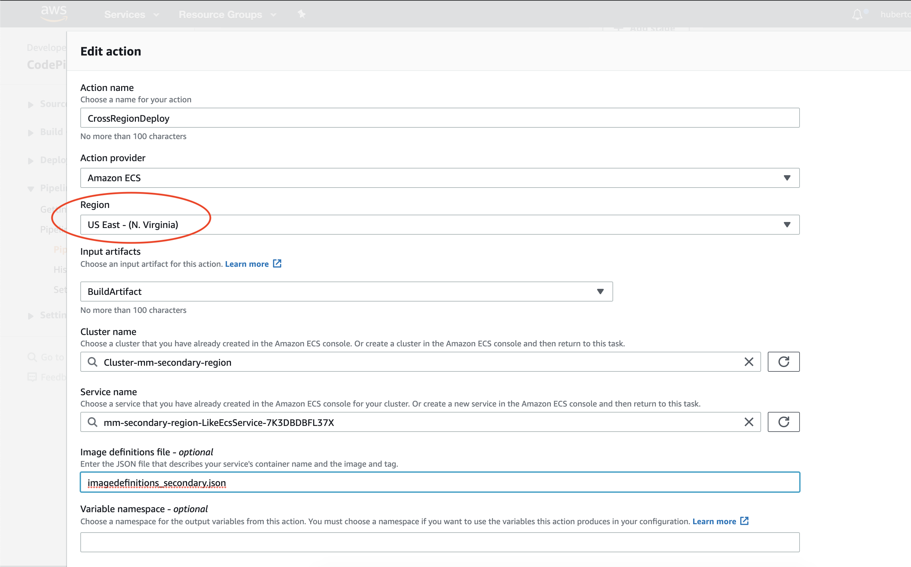
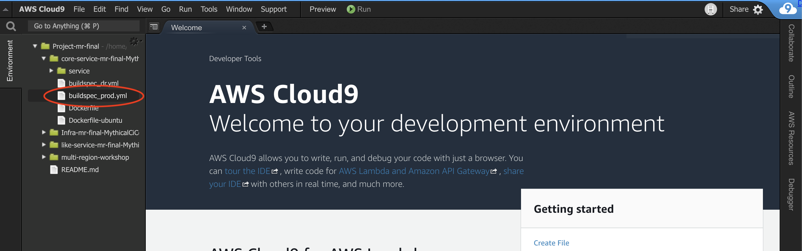

# Mythical Mysfits: Multi-Region-Workshop

**To do list:**<br>
✅ Distributed Tracing with AWS X-Ray<br>
✅ Gather AWS Metrics<br>
---- Prepare for multi-region deployments<br>
---- Implement Global Accelerator<br>
---- Load test and failover<br>


## Lab 3 - Preparing for Multi-Region Deployments

Moving to a multi-region application is no easy task. We need to not only make sure the infrastructure is available, but also the artifacts like Docker images, and then the application itself. In addition, the observability dashboards have to be updated to reflect multiple regions. Some logical things to think about are how do I understand the state of my application in both regions? How do I know when I need to failover into a secondary region? How do I test my secondary region deployment?

In this lab, you will begin preparations for moving your application to multiple regions. It's very common to forget a number of steps along the way as many people will mainly think of infrastructure and the application itself to move over, but there are a number of assets that also need to be referenced.

These are the things that we will need to replicate and/or also automate:
* Infrastructure
  * Network
  * Docker Repositories
  * ECS
  * Monitoring
* Container images
* Application Deployment Pipeline
* Application(s)

<!-- Here's a reference architecture for what you'll be building:

[TODO] CREATE REF ARCHITECTURE PICTURE


Here's what you'll be doing:

[TODO] CREATE TOC
* [Create AWS CodeBuild Project](#create-aws-codebuild-project)
* [Create BuildSpec File](#create-buildspec-file)
* [Test your AWS CodeBuild Project](#test-your-aws-codebuild-project) -->

### Infrastructure Replication
At the beginning of the workshop, you used [AWS CloudFormation](https://aws.amazon.com/cloudformation/) to launch a stack and create the Lab-0 base infrastructure. We'll do the same thing now to replicate it, but we'll enter in a different parameter.

<details>
<summary>Learn more: AWS CloudFormation deployment options</summary>

What you are about to do is quite likely the simplest way of deploying another CloudFormation stack. You will run a CLI (Command Line Interface) command to deploy the same CloudFormation template into a different region. Specfically, we will be telling CloudFormation to deploy into the us-east-1 region.

There are a number of different ways to achieve this, like using [AWS CloudFormation Stacksets](https://docs.aws.amazon.com/AWSCloudFormation/latest/UserGuide/what-is-cfnstacksets.html) or using [AWS CodePipeline to trigger CloudFormation in a CI/CD pipeline](https://docs.aws.amazon.com/AWSCloudFormation/latest/UserGuide/continuous-delivery-codepipeline.html). Both of these are a much more automated way of deploying into multiple regions, but for simplicity's sake, in this lab you will use the simplest method of using the CLI.
</details>

Navigate back to the [AWS Cloud9 console](http://console.aws.amazon.com/cloud9) and access your working environment. Run these commands:

<pre>
$ cd ~/environment/aws-multi-region-bc-dr-workshop
$ aws cloudformation deploy --stack-name mm-secondary-region --template-file cfn/core.yml --capabilities CAPABILITY_NAMED_IAM CAPABILITY_AUTO_EXPAND --parameter-overrides IsDrRegion=true --region us-east-1
</pre>

<details>
<summary>Learn more: What did you just do</summary>
  In Lab-0, we deployed a CloudFormation stack that had all the core components of the infrastructure, such as:
  * VPC (subnets, route tables, routes, etc)
  * ECS (task definitions, services, etc)
  * CICD Stack (AWS CodePipeline, AWS CodeBuild)

What you just did was replicate a portion of that based on the `IsDrRegion=true` flag. We set the flag to true this time to spin up some additional resources and not spin up others.
</details>

Once you see **Waiting for changeset to be created..Waiting for stack create/update to complete**, you can continue on. This doesn't mean the stack is done, but you can do the Database Replication portion in parallel. Check back later and make sure you see **Successfully created/updated stack - mm-secondary-region**.

### Database Replication

The most difficult part of a multi-region application is typically data synchronization. Now that you have a separate stack in the Secondary region, we need to set up DynamoDB so that it automatically replicates any data created using the app in the primary region.

There's an easy way to do this - DynamoDB Global Tables. This feature will ensure we always have a copy of our data in both our primary and failover region by continuously replicating changes using DynamoDB Streams. We'll set this up now.

[TODO - Add screenshots]

1. Open up the [DynamoDB console](https://console.aws.amazon.com/dynamodb/) and ensure the region selected is your Primary region
2. Select **Tables** from the menu on the left and select the table **MythicalMysfits-DDBTable**
3. Select the tab marked **Global Tables** and then press **Enable Streams**. Wait for this to complete (about 2 mins).
4. Add the Secondary region by selecting **Add region**, select the Secondary region from the list and click **Create replica**. *If you receive an error during this phase, try the Add replica step again - this error may occue if step 3 has not completed fully*.
5. The replica will take a few minutes to create and populate in the Secondary region. While this is happening, you can proceed to the next step.

<details>
 <summary>Learn more: What did I just do?</summary>
 You have just converted a regional DynamoDB table to a Global DynamoDB table. Doing this will automatically replicate the items in the table to any region that has a replica table configured using the above process. This ensures that our database tier (our DynamoDB table in this case) will remain in sync between the regions and is both writable and readable from any region that has a replica configured.

 * [Blog - converting a Single-Regional DynamoDB table to a Global Table](https://aws.amazon.com/blogs/aws/new-convert-your-single-region-amazon-dynamodb-tables-to-global-tables/)
 * [DynamoDB Core Components](https://docs.aws.amazon.com/amazondynamodb/latest/developerguide/HowItWorks.CoreComponents.html)
 * [DynamoDB Global Tables](https://docs.aws.amazon.com/amazondynamodb/latest/developerguide/GlobalTables.html)
 </details>

### Deployment Replication

Now that you have all your artifacts replicated into the secondary region, you can automate the deployments too. The CICD infrastructure is already provisioned for you. To automate the deployments into the secondary region, we'll use [AWS CodePipeline's Cross-Region Actions](https://aws.amazon.com/about-aws/whats-new/2018/11/aws-codepipeline-now-supports-cross-region-actions/). This lets you see all your deployments across both regions in one place.

<details>
<summary>Learn more: Deployment pipeline options</summary>
You may be thinking. Why didn't we create a deployment pipeline in the secondary region? This is one way of doing things. Having a single pipeline in one region lets you ensure your application is consistent in both regions. With this method, you can still roll back to previous deployments manually in the event that there's an issue in the primary and you want to do that.

Isolation could also be another reason to have a second pipeline in a second region, but what you should think about is risk. How will you also deploy to the primary region? What if there's an outage? Do you want to be triggering deployments at that time? Inconsistent states are what you want to avoid, and this is one of the challenges with multi-region applications.
</details>

Navigate to the [CodePipeline console](http://console.aws.amazon.com/codepipeline) of the **PRIMARY** region. Click on the pipeline that starts with *Core*. Note that if your pipelines are not in a **Succeeded** state, there was a problem. Try to get your deployments into a **Succeeded** state before proceeding. You may have to re-run some setup scripts.



Click on **Edit** and **Add stage** after the Deploy stage.



Type in **CrossRegionDeploy** for the stage name.



Next we will configure the stage so that it deploys to ECS in the secondary region. In the new CrossRegionDeploy stage, click **Add Action Group**. Enter in the following details in the **Edit Action** popup:

**Edit Action**:
* Click on **Add Action Group** and enter the following details:
* Action name: **CrossRegionDeploy**
* Action provider: **Amazon ECS**
* Region: **Choose the secondary region you deployed into** - By default, this should be US East - (N. Virginia)
* Input artifacts: **BuildArtifact**
* Cluster name: **Choose the cluster that was created for you. It will start with Cluster-**
* Service name: **Select the service that includes "Core"**
* Image definitions file: **imagedefinitions_secondary.json** - The value of this will depend on what you output in your buildspec. Our default is imagedefinitions_secondary.json.



Click **Done** and then **Save** at the top of the screen. Click through prompts until you're back at the pipeline. At this point, you should see your pipeline again and the final stage will be grey because it has not run yet. It will look like this:


**Do this again for the Like Service**



**Edit Action**:
* Click on **Add Action Group** and enter the following details:
* Action name: **CrossRegionDeploy**
* Action provider: **Amazon ECS**
* Region: **Choose the secondary region you deployed into** - By default, this should be US East - (N. Virginia)
* Input artifacts: **BuildArtifact**
* Cluster name: **Choose the cluster that was created for you. It will start with Cluster-**
* Service name: **Select the service that includes "Like"**
* Image definitions file: **imagedefinitions_secondary.json** - The value of this will depend on what you output in your buildspec. Our default is imagedefinitions_secondary.json.



### Update build scripts to upload docker images to both regions

In the previous section, we automated the deployments into another region. Now we have to update the rest of the build steps to upload artifacts into the secondary region. As part of the infrastructure automation, we gave you the application for both **core** and **like** services. We will now have to update the buildspec_prod.yml file of both services to upload the container images to the secondary region.

<details>
<summary>Learn more: What is a buildspec file?</summary>

In this workshop, we created an [AWS CodePipeline](https://aws.amazon.com/codepipeline/) stage that calls [AWS CodeBuild](https://aws.amazon.com/codebuild/),  which is a fully managed continuous integration service that compiles source code, runs tests, and produces software packages that are ready to deploy.

AWS CodeBuild uses a definition file called a buildspec yaml file. The contents of the buildspec will determine what AWS actions CodeBuild should perform. The key parts of the buildspec are Environment Variables, Phases, and Artifacts. See [Build Specification Reference for AWS CodeBuild](http://docs.aws.amazon.com/codebuild/latest/userguide/build-spec-ref.html).

</details>

You have (2) options at this point:

Follow the steps below, using the provided documentation (and hints if you get stuck), to add lines of instrumentation code to the Like service. If you go this route, try not spend more than 5 min on each step if you're at an AWS event with a time limit. We want you to be able to get through as many of the labs as possible.

OR

Run the `bootstrap/secondary-region/setup` script. If you're short on time or would rather focus on the traffic management bits later in the workshop, reveal and follow the Option 2 step by step below.

**Choose your adventure!**

<details>
<summary>Option 1: Step-by-step manual instructions</summary>

First, we will update the **core-service** app. Navigate to the **core-service** CodeCommit repo. We can do this in the side navigation pane or via CLI.

Console:


CLI:
```
$ cd ~/environment/core-service-[PRESS TAB TO AUTO COMPLETE AND PRESS ENTER]
```

Find the **buildspec_prod** file in both core-service and like-service. Update them to push your built containers  to both your primary and secondary regions. Within both of the buildspec files there are [TODO] lines to guide you through what you'll need to do. It's your choice if you want to understand how the build process works. Otherwise...

We have created some completed buildspec files if you want to skip this portion. They are in the app/hints folder.

```markdown
$ cd ~/environment/core-service-[PRESS TAB TO AUTO COMPLETE AND PRESS ENTER]
$ cp ~/environment/multi-region-workshop/app/hints/core-buildspec_prod.yml buildspec_prod.yml
$ cd ~/environment/like-service-[PRESS TAB TO AUTO COMPLETE AND PRESS ENTER]
$ cp ~/environment/multi-region-workshop/app/hints/like-buildspec_prod.yml buildspec_prod.yml

Open the two files and replace these variables:
* REPLACEME_SECONDARY_REGION with your secondary region (default **us-east-1**) in both buildspec_prod.yml files
* REPLACEME_CORE_REPOURI_SECONDARY with the value of **SecondaryMythicalServiceEcrRepo** from the Cloudformation outputs in the Core service buildspec_prod.yml
* REPLACEME_LIKE_REPOURI_SECONDARY with the value of **SecondaryLikeServiceEcrRepo** from the CloudFormation outputs in the Like service buildspec_prod.yml

**Note that in these labs we are hard coding values, but best practice is to use environment variables instead. This just simplifies the process for illustrative purposes.**
```

### Trigger deployment again

Finally, add all the files to both repos and trigger deployments:

<pre>
  $ cd ~/environment/<b>core-service-[PRESS TAB TO AUTO COMPLETE AND PRESS ENTER]</b>
  $ git add -A
  $ git commit -m "Updating core buildspec for multi-region deploy"
  $ git push origin master
  $ cd ~/environment/<b>like-service-[PRESS TAB TO AUTO COMPLETE AND PRESS ENTER]</b>
  $ git add -A
  $ git commit -m "Updating like buildspec for multi-region deploy"
  $ git push origin master
</pre>

</details>

<details>
<summary>Option 2: Skip this step</summary>

Navigate back to the [AWS Cloud9 console](http://console.aws.amazon.com/cloud9) and access your working environment if you're not already there. Run these commands:

<pre>
  $ cd ~environment/aws-multi-region-bc-dr-workshop
  $ bootstrap/secondary-region/setup
</pre>

</details>

The last step of both of the options above will commit and push your new application code. Take a look at your pipelines in the AWS CodePipeline Console and you should see the deployments start. Wait until all deployments are complete.


### Enabling Cloudwatch Dashboard to show multi-region metrics

Now that you have deployed the stack in the secondary region, lets adjust the Cloudwatch dashboard that you created in the previous lab to include these new resources. This will provide visibility to the Mythical and Like services running across both regions on the same dashboard.

If you are unfamiliar with Amazon Cloudwatch, you may consider creating a duplicate of the current Cloudwatch dashboard for safe keeping. That way you can always revert back to the original if you need to.

<details>
    <summary>Instructions: How do I do this?</summary>

* Select the Cloudwatch dashboard you wish to duplicate
* Click **Actions** followed by **Save dashboard as...**
* Enter a name for the new dashboard - **BackupOfMyDashboard**
* Click **Save dashboard**

</details>


### X. Edit the widgets to show metrics from the other region

With Amazon Cloudwatch, we have the ability to stack metrics on top of each other in a widget that contains a graph. This will be useful in our case where we are viewing the same metric type, over two resources. We'll do this in the steps below in addition to adding the metrics from the other region.

Hint - see documentation for [Editing a Graph on a Cloudwatch Dashboard](https://docs.aws.amazon.com/AmazonCloudWatch/latest/monitoring/edit_graph_dashboard.html)

### X.a Edit the ALB widgets

As we are now adding in metrics from two different regions, we must navigate to the secondary region and load the dashboard from there. This is because when referring to metrics within a dashboard, Cloudwatch can only see resources local to that region.

Modify the ALB Requests Per Minute widget to show the metrics from the ALB in the secondary region:

* Open up the [Cloudwatch Dashboards](https://console.aws.amazon.com/cloudwatch/) page and select the dashboard from the previous lab
* Change the region (top right of screen) to your Secondary region
* Add in the **RequestCount** metric to this widget from the ALB
* Add in the **ALB 2XX, 4XX and 5XX** metrics to this widget from the ALB
* Change the metric labels to identify the correct region for specified metric

<details>
    <summary>Hint with screenshots:</summary>

* Hover over the widget and select Edit in the top right hand corner

* Change the graph type from a Line to Stacked Area. Then select the All Metrics tab and add in the **requestcount** metric from the ALB

* Select Graphed Metrics and change the label to match the region

* Click **Update widget**
    </details>

Modify the ALB HTTP Responses widget to show the metrics from the ALB in the secondary region:

* Change the widget to a stacked area
* Add in the **HTTP 2XX / 4XX / 5XX Count** metrics from the ALB
* Change the metric labels to identify the correct region for that metric
* Ensure the region you put in the label matches the region in the details
* Click **Update widget**

<details>
<summary>Show screenshot:</summary>


</details>


### X.b Add widgets for the Like and Mythical Services from Secondary region

Following the same process from Lab 2, add a new widget for each of the Like and Mytical services. Modify the titles to be able to easily identify which region they are populating from. You should end up with something like this:


Feel free to move the widgets around the dashboard to suit your style following the instructions in the [https://docs.aws.amazon.com/AmazonCloudWatch/latest/monitoring/move_resize_graph_dashboard.html](Cloudwatch documentation).
Youc can drag widgets around and move them into position wherever you like. You can also add a text widget to show a title, include links to a knowledgebase wiki or internal tooling. Get creative!

[TODO - Add Andy's KPIs / other metrics from X-Ray]

### X.c Add a widget to show statistics from the DynamoDB Global Table

While we're at it, lets create a new widget showing the the Read Capacity Units and Write Capacity Units for our newly created Global Table. Monitoring the table ensures that we have full visibility of the amount of read and write activity which can be useful in troubleshooting efforts.

Here's how:

* Create a new stacked area graph on the Cloudwatch Dashboard
* Select **DynamoDB**, **Table Metrics**, **[insert table name]**, **ConsumedReadCapacityUnits** and **ConsumedWriteCapacityUnits**
**ConsumedWriteCapacityUnits** for our DynamoDB Global Table.
* Change the statistic type to **Sum**
* Click **Create Widget**

## Important - Save your Cloudwatch Dashboard! ##

# Checkpoint

At this time, your application should be running in both regions. Hit the secondary **SecondaryLoadBalancerDNS** that you copied earlier. You should see the exact same site you had before.

Proceed to [Lab 4](../lab-4-globalacc)!


<!--
# disregard

In this section, you will begin preparations for moving your application to multiple regions. It's very common to forget a number of steps along the way as many people will mainly think of infrastructure and the application itself to move over, but there are a number of assets that also need to be referenced.

These are the things that we will need to replicate and also automate:
* Infrastructure
  * Network
  * Docker Repositories
  * ECS
* Container images
* Application Deployments


- Also need to copy over artifacts for deployment
- ECR cross region replication?
- object replication in S3
- codecommit x-region app
-


### Replicate The app to a second region

    aws cloudformation deploy --stack-name second-region --template-file core.yml --capabilities CAPABILITY_NAMED_IAM --region us-west-2 -->
