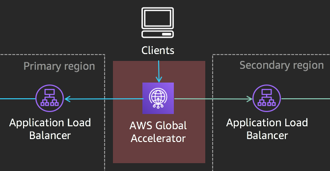
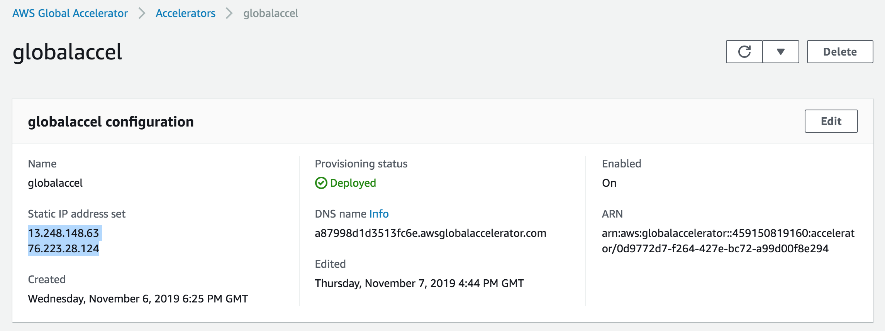

# Mythical Mysfits: Building Multi-Region Applications that Align with BC/DR Objectives

## Workshop progress
✅ [Lab 0: Workshop Initialization](../lab-0-init)

✅ [Lab 1: Instrument Observability - Distributed Tracing with AWS X-Ray](../lab-1-xray)

✅ [Lab 2: Operationalize Observability - Aggregate Metrics](../lab-2-agg)

✅ [Lab 3: Preparing for Multi-Region Deployments](../lab-3-mr-prep)

**Lab 4: Implement Traffic Management - Global Accelerator**

* [Create and configure an AWS Global Accelerator](#1-create-and-configure-an-aws-global-accelerator)
* [Configure your Global Accelerator](#2-configure-your-global-accelerator)
* [Test your Global Accelerator](#3-test-your-global-accelerator)

[Lab 5: Load Test and Failover your multi-region application](../lab-5-loadtest)

## LAB 4 - Implement Traffic Management - Global Accelerator

In previous labs, we've set up our website such that it runs in both primary and secondary regions. However, at the moment, traffic is targeted at only the primary region. This is where traffic management comes into the picture. Traffic management is one of the last pieces of the puzzle when it comes to multi-region architectures. The one that we will focus on today is [AWS Global Accelerator](https://aws.amazon.com/global-accelerator/). AWS Global Accelerator is a network layer service that directs traffic to optimal regional endpoints based on health, client location, and policies that you configure. It provides you with static IP addresses that you associate with your accelerator which will act as a fixed entry point to your application endpoints in one or more AWS Regions.

Global Accelerator uses the AWS global network to optimize the network path from your users to your applications, improving performance. It also monitors the health of your application endpoints and reacts instantly to changes in health or configuration. It will redirect user traffic to healthy endpoints that deliver the best performance and availability to your users.

In this lab, you will build upon the infrastructure you created in previous labs and use AWS Global Accelerator to route traffic between the Application Load Balancers in your primary and secondary regions.

Here's a reference architecture for what you'll be building:

Here's what you'll be doing:
* Create an Accelerator
* Add Listeners
* Add Endpoint Groups
* Add Endpoints
* Test your Accelerator

### Instructions

### [1] Create and configure an AWS Global Accelerator

Learn more: AWS Global Accelerator

By default, AWS Global Accelerator will provision two (2) static IP addresses. These IP addresses are anycast from AWS edge locations so they allow access to your users from anywhere in the world and they will be automatically routed to the nearest edge to enter the AWS network. This allows you to use static IP addressing to access your application instead of DNS.

When routing, AWS Global Accelerator continues to use ALB/ELB health checks to ensure your application is up and running before routing traffic. If the health status of your application changes, AWS Global ACcelerator will route traffic to the next available endpoint. One of the benefits is that this allows you to focus on the application itself instead of working around client DNS caching for failovers.

Further reading:
* [AWS Global Accelerator FAQ](https://aws.amazon.com/global-accelerator/faqs/)
* [AWS Global Accelerator for Availability and Performance](https://aws.amazon.com/blogs/aws/new-aws-global-accelerator-for-availability-and-performance/)

#### a. Name your AWS Global Accelerator

First thing's first, we need to name the AWS Global Accelerator. You can name it anything you like, but to the follow the rest of the workshop's naming conventions, we'll name it **mm-global-accelerator**.

1. Navigate to the [AWS Global Accelerator dashboard](https://us-west-2.console.aws.amazon.com/ec2/v2/home?region=us-west-2#GlobalAcceleratorDashboard:).
2. Choose **Create accelerator**.
3. Provide a name for your accelerator - in our case **mm-global-accelerator**
4. Click **Next**.

  

#### b. Configure your Global Accelerator - Add listeners

The next step in the AWS Global Accelerator is to add [listeners](https://docs.aws.amazon.com/global-accelerator/latest/dg/about-listeners.html). A listener processes inbound connections from clients to Global Accelerator, based on the protocol and port (or port range) that you configure. Listeners can be added at any time and determine what traffic the AWS Global Accelerator should expect.

1. With AWS Global Accelerator, you add listeners that process inbound connections from clients based on the ports and protocols that you specify. At the **Add Listeners** step, enter the following:

* **Ports**: Enter 80.
* **Protocol**: Choose TCP.
* **Client affinity**: Leave as None.
* Click **Next**.

  

#### c. Configure your Global Accelerator - Add Endpoint Groups

Now that the AWS Global Accelerator is aware of what kind of traffic is going to come in, it has to know where to route the traffic once it receives it. An endpoint group routes traffic to one or more registered endpoints in AWS Global Accelerator. When you add a listener, you specify the endpoint groups for Global Accelerator to direct traffic to. An endpoint group, and all the endpoints in it, must be in one AWS Region. You can add different endpoint groups for different purposes, for example, for blue/green deployment testing.

Global Accelerator directs traffic to endpoint groups based on the location of the client and the health of the endpoint group. You can also set the percentage of traffic to send to an endpoint group. You do that by using the traffic dial to increase (dial up) or decrease (dial down) traffic to the group. The percentage is applied only to the traffic that Global Accelerator is already directing to the endpoint group, not all traffic coming to a listener.

At the **Add endpoint groups** step, enter the following:

* **Region**: Choose the primary region that you deployed the application in - If you followed defaults, us-west-2
* **Traffic dial**: Leave as 100.
* Choose **Add endpoint group**.
* **Region**: Choose the secondary region that you deployed the application in - If you followed defaults, us-east-1.
* **Traffic dial**: Leave as 100.
* Click **Next**.

#### d. Add Endpoints

Endpoints in AWS Global Accelerator can be Network Load Balancers, Application Load Balancers, EC2 instances, or Elastic IP addresses. A static IP address serves as a single point of contact for clients, and Global Accelerator then distributes incoming traffic across healthy endpoints. Global Accelerator directs traffic to endpoints by using the port (or port range) that you specify for the listener that the endpoint group for the endpoint belongs to.

Each endpoint group can have multiple endpoints. You can add each endpoint to multiple endpoint groups, but the endpoint groups must be associated with different listeners.

The endpoints we’ll be using are the Application Load Balancers in the primary and secondary region. At the **Add endpoints** step, do the following:

* Under the primary region endpoint group, choose **Add endpoint**.
* **Endpoint type**: Choose Application Load Balancer.
* **Endpoint**: Choose the load balancer associated with this application.
* Under the secondary region endpoint group, choose **Add endpoint**.
* **Endpoint type**: Choose Application Load Balancer.
* **Endpoint**: Choose the load balancer associated with this application.
* Click **Create accelerator**.

### [3] Test your Global Accelerator

Before testing your accelerator, wait for the Status of your Accelerator to go from In progress to **Deployed**. Once it’s deployed, click on the name of your Accelerator. Check that the Status of the Listener is **All healthy**. Drill down to your endpoints and check that their Health status is **Healthy**. Now that your accelerator is deployed and your listener and endpoints are healthy, go back to your accelerator and copy one of the IP addresses. You can find the IP addresses in the configuration panel under **Static IP address set**. Test the static IP address in your browser. You should see the your Mythical Mysfits!

# Checkpoint

Congratulations!!! You've successfully created an accelerator to route traffic to both your primary and secondary region.

Proceed to [Lab 5](../lab-5-loadtest)!
